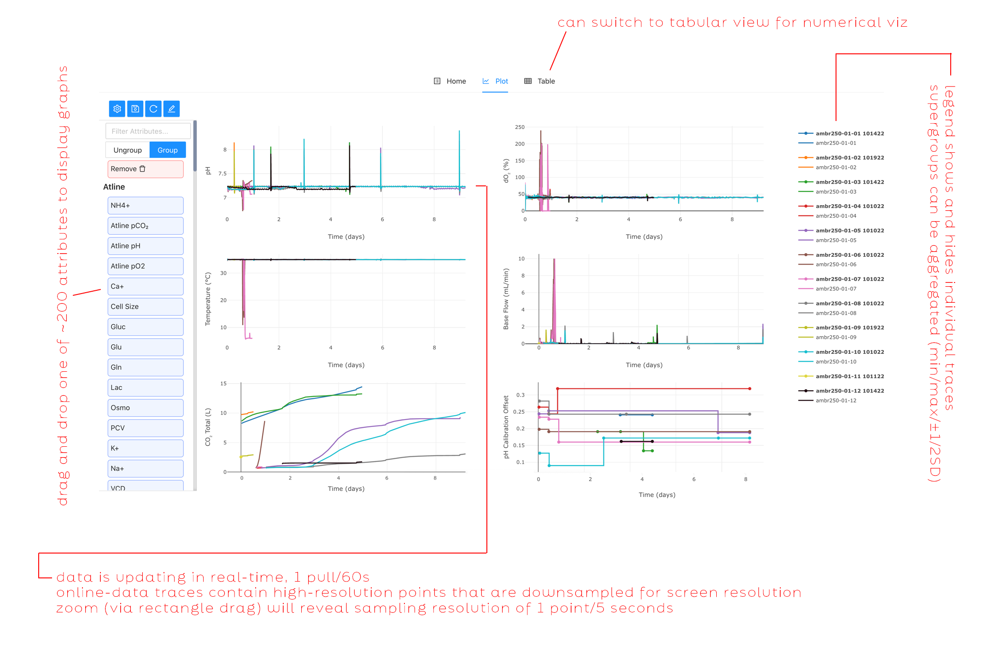

# Rin G

Full-stack software engineer with research background, specializing in data visualization and design. 

*(Note: Unfortunately the bulk of my work has been NDA and I'm still in the processing of removing protected data. However today I'm putting up a small sample of past work.)*

## Two web-based visualization examples for scientific data
### Aggregated bioreactor data visualization in the cloud  
A large project coded in React/redux. Uses an extensive API pulling from complex datasources. High interactability (via user context) by Plotly and React. 

This screenshot shows 6 time-series plots (pH, DO2, Temperature, Base Flow, CO_2, pH Calibration offsets -- diverse data-types with different origins and sampling resolutions) for 12 small-scale bioreactors. If the experiment is active, the plots will update in real-time and is performant up to ~48 bioreactors (the user-defined max use case). 

Users typically use this view to monitor experiments live, while overlaying them with past experiment performance, and can export data for local statisical analysis if needed.

### Variability in raw material vendor lots

A small (1-page) project coded in d3/js, showing bar/scatter plots. Small, researcher-maintained datasource.

#### Plot functionality overview

Left scatter plot: the contribution of each component (x-axis) to the final measured trace element concentration (y-axis). Hovering shows the vendor lot and assay number so users can follow up as needed.

Right stacked bar plot: this gives the user an idea of the min, max, and average ranges of this trace element (in this case, Mn) that they might see in this process.

#### The user can scroll through many plots

The embedded table is populated with data from a GCP asset maintained by Media Development researchers, but can be edited within the browser for immediate feedback. The page generates 16x2 plots total (colors conserved across the plots).

## Non-scientific visualization design work

In my free time I do a lot of extra-curricular design work with new-media tools where I can collaborate with other designers and artists. 

### Easterner Hydra set (2024)

Generative visualization of 3 FFT bins in JS/P5, contract for a composer client. (This is a dev session; the final product was a "live-coding" performance in front of an audience at Gray Area SF.)

#### Embedded video

<video controls src='https://github.com/user-attachments/assets/1757d33e-37a8-4078-ad76-4be0889dbc15
' width="100%"></video>

